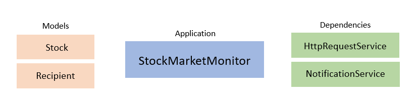

# Stock Market Monitor
- Azure Function application in .NET Core monitoring open prices for selected equities on NASDAQ
- Email and text message notifications are sent out to selected recipients once quotes have been collected

# Information
- C#, .NET Core
- Azure Functions
- Alpha Vantage used as Stock API
- Mailkit used for email notifications
- Library for text message notifications to be decided

# Overview

